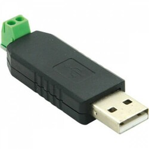

# hdec -- Python module for the "Heidelberg Energy Control" Wallbox 

This python module aims at controlling the "Heidelberg Energy Control" Wallbox 
via its Modbus interface. A special goal is providing a module for the 
openWB software.

You may install this python module on your openWB Raspi, connect your 
Heidelberg via a cheap RS485/USB adapter, apply some configuration and then use 
the Wallbox as charging point in openWB.

The concept of this module, inprinciple, is as follows:
- use the python lib `heidelberg` controlling the wallbox by its Modbus interface
- start a minimal webserver 
- provide a "Go-e"-like interface
- use it as openWB charging point(s) (yes, it's untested but reasonable that more than one box can be controlled)
- as interface for humans, this module simply shows a status display 

## Caveats
This software is provided "as is". There is no guarantee that it works as 
expected. There is, in particular, no guarantee that all hardware survives
use of this software.

## Pictures
The type of RS485/USB adapter that I use:

<p align="center"> 
   
</p>

## Installation
### Prerequisites
Check, whether `minimalmodbus` is installed, as with
`echo "import minimalmodbus;print('Ok')" | python3`  
If not, have a look at its [project page](https://pypi.org/project/minimalmodbus/).

It is assumed that you already have at least one Heidelberg Energy Control Box
installed, that RS-485/Modbus wiring is ok and that you know the Modbus ID(s). 
Don't forget to terminate the RS-485/Modbus on the last box (see manual). The
box must be configured to be a "follower". Modbus "leader" is your raspi.

### Install the module
```
cd /tmp
git clone https://github.com/leuzoe/hdec
cd /var/www
sudo mkdir hdec
sudo chown pi hdec
cd hdec
cp -ra /tmp/hdec/src/* .

cd /etc/systemd/system
sudo cp /tmp/hdec/service/hdec.service .
sudo systemctl enable hdec
sudo service hdec start
```

### Configuration
Have a look at `/var/www/hdec/config.ini` and change parameters, if needed:

- standard log file is placed within the openWB ramdisk
- webserver host is set to `0.0.0.0` which makes it accessible on all interfaces, you can restrict this to localhost by setting `host=127.0.0.1`
- `maxclientid` is the maximum Modbus ID addressed: the module makes all boxes accessible, from ID 1 up to `maxclientid`

If you make changes in configuration, you have to restart the hdec.service:  
`sudo service hdec restart`

### Check
Surf to `http://your_raspi:8182/`

If you see a Website `Kurze Hinweise ...`, it seems to work.

Surf to `http://your_raspi:8182/1/variables.html` and you should see some values
of your box **with ID 1**. If client ID of your box is 5, ... ...I think you know what to change...

### Error check
- Modbus terminated?
- Modbus wiring ok? Polarity matters!
- Modbus Client ID of the box(es) ok?
- Have a look at `/var/www/html/openWB/ramdisk/hdec.miniserver.log` (or whatever you set in `config.ini`)


### openWB integration
First, add as many charging points of type "Go-e" as you need, give them dummy IP addresses as 9.9.9.1, 9.9.9.2 or similar. Save this configuration.

As of time of this writing, openWB's web interface does not accept port numbers
of web servers and paths on web servers in its charging point configuration 
page.

Therefore, you have to edit `/var/www/html/openWB/openwb.conf` manually:  
change 9.9.9.1 to `127.0.0.1:8182/1` (for box with Modbus Client ID 1),  
change 9.9.9.2 to `127.0.0.1:8182/2` (for box with Modbus Client ID 2)  
and so on.

To check the successful openWB integration, you may have a look at its status page.


## See also, Credits
- [openWB](https://openwb.de/main/)
- Steffs [wbec](https://github.com/steff393/wbec)
- other HD Energy Control projects on github: [MQTT (homie) Connector](https://github.com/tmsch13/heidelberg-wallbox-connector), [Adapter issues](https://github.com/ioBroker/AdapterRequests/issues/559)
- [go-e API](https://github.com/goecharger/go-eCharger-API-v1/blob/master/go-eCharger%20API%20v1%20DE.md)
- [minimalmodbus](https://pypi.org/project/minimalmodbus/)

Fruitful discussion with openWB user "raspi-buechel" is worth being mentioned.

